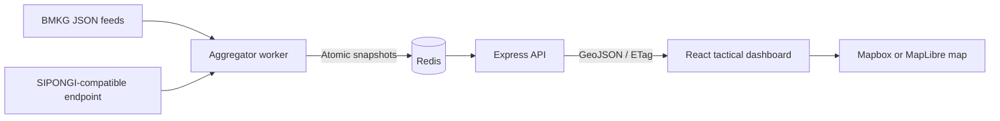

# NERV-Geo

NERV-Geo is a real-time disaster monitoring dashboard for Indonesia. It combines current-day disaster telemetry into a Redis-backed GeoJSON snapshot and presents it through a tactical, science-fiction-inspired web interface.

The current MVP integrates official BMKG earthquake feeds. A configurable SIPONGI KLHK adapter is included, but its live endpoint must be validated through an authorized public session before production use.

## Current status

| Capability         | Status               | Notes                                                                                               |
| ------------------ | -------------------- | --------------------------------------------------------------------------------------------------- |
| BMKG earthquakes   | Operational          | Combines `gempaterkini` and `gempadirasakan`, filters the current WIB day, and deduplicates events. |
| SIPONGI hotspots   | Integration ready    | Adapter and contract fixture exist; the actual authorized endpoint is not committed.                |
| Tactical map       | Operational          | Uses Mapbox `dark-v11` with a valid public token and MapLibre/OpenStreetMap as a local fallback.    |
| Redis snapshot     | Operational          | Provider snapshots, last-known-good data, combined GeoJSON, and job locks.                          |
| Alert audio        | Local asset required | Supply a legally usable `japan-eas.mp3`; the file is intentionally ignored by Git.                  |
| Historical storage | Not included         | Data is ephemeral and reset every midnight WIB.                                                     |

## Features

- Polls BMKG and SIPONGI-compatible providers every five minutes.
- Normalizes provider responses into one validated GeoJSON `FeatureCollection`.
- Uses deterministic feature IDs to prevent duplicate incidents.
- Retains the last-known-good snapshot when one provider temporarily fails.
- Classifies events as `CRITICAL` or `WARNING` and attaches mitigation guidance.
- Displays clustered incidents and pulsing severity markers on an Indonesia-focused map.
- Opens an accessible tactical HUD with incident time, location, source, severity, and mitigation.
- Supports marker-triggered alert audio, mute controls, keyboard closing, and reduced motion.
- Exposes health checks, conditional requests with ETags, CORS controls, and rate limiting.

## Architecture



This repository is an npm workspaces monorepo:

```text
apps/
  api/                 Express API, provider adapters, Redis repository, and worker
  web/                 React/Vite tactical dashboard and browser tests
packages/
  contracts/           Shared TypeScript and Zod GeoJSON contracts
docs/
  production-runbook.md
  sipongi-contract.md
```

## Technology

- React 19, Vite, TypeScript, Tailwind CSS
- Mapbox GL JS with a MapLibre/OpenStreetMap local fallback
- Node.js 24, Express 5, `node-cron`
- Redis 8
- Zod, Vitest, Testing Library, and Playwright
- Docker Compose and Nginx

## Prerequisites

- Node.js 24 or newer
- npm 11 or newer
- Docker Desktop, or a separately installed Redis server
- A public Mapbox token for the production Mapbox basemap
- An authorized SIPONGI endpoint if wildfire data will be enabled

## Local development

Install dependencies and create a local environment file:

```powershell
npm install
Copy-Item .env.example .env
```

Start Redis, then launch the API, worker, and frontend:

```powershell
docker compose up -d redis
npm run dev
```

Development URLs:

| Service          | URL                                   |
| ---------------- | ------------------------------------- |
| Web dashboard    | `http://localhost:5173`               |
| Disaster GeoJSON | `http://localhost:3000/api/disasters` |
| Liveness         | `http://localhost:3000/health/live`   |
| Readiness        | `http://localhost:3000/health/ready`  |

The worker performs an aggregation immediately at startup. BMKG requires outbound internet access. SIPONGI remains `unavailable` until a real endpoint is configured.

### Map configuration

Set `VITE_MAPBOX_TOKEN` to a real Mapbox public token to use `mapbox://styles/mapbox/dark-v11`. A valid public token begins with `pk.` and is embedded in the frontend bundle, so restrict it by allowed URL in the Mapbox dashboard.

When the token is absent or still a placeholder, local development automatically uses a darkened OpenStreetMap raster basemap through MapLibre. Restart Vite after changing any `VITE_*` value.

### Alert audio

Place a licensed audio file at:

```text
apps/web/public/audio/japan-eas.mp3
```

That path is ignored by Git. Each developer or deployment environment must supply its own legally usable asset.

## Environment variables

Start from [`.env.example`](./.env.example). Never commit the resulting `.env` file.

| Variable                | Used by    | Required          | Sensitive   | Description                                                            |
| ----------------------- | ---------- | ----------------- | ----------- | ---------------------------------------------------------------------- |
| `PORT`                  | API        | No                | No          | HTTP port; defaults to `3000`.                                         |
| `REDIS_URL`             | API/worker | Yes               | Potentially | Redis connection URL. Treat it as secret when it contains credentials. |
| `CORS_ORIGIN`           | API        | Yes               | No          | Exact frontend origin allowed by CORS.                                 |
| `SIPONGI_ENDPOINT`      | Worker     | For wildfire data | Internal    | Authorized server-side endpoint; never expose it through `VITE_*`.     |
| `SIPONGI_AUTHORIZATION` | Worker     | If required       | **Yes**     | Optional authorization header used only by the worker.                 |
| `SIPONGI_*_PARAM`       | Worker     | No                | No          | Configurable date and pagination query names.                          |
| `VITE_MAPBOX_TOKEN`     | Web        | Production map    | Public      | Public, URL-restricted Mapbox token. Do not use a secret token.        |
| `VITE_API_URL`          | Web        | Yes               | No          | Browser-visible disaster API URL.                                      |

Only variables prefixed with `VITE_` are exposed to browser code. Server credentials must never use that prefix.

## API contract

`GET /api/disasters` returns a GeoJSON `FeatureCollection` directly. Coordinates always use GeoJSON order: `[longitude, latitude]`.

Important response metadata:

```json
{
  "metadata": {
    "dateWib": "YYYY-MM-DD",
    "generatedAt": "ISO-8601 UTC",
    "sources": [
      {
        "name": "BMKG",
        "status": "ok",
        "fetchedAt": "ISO-8601 UTC"
      }
    ]
  }
}
```

Provider states:

- `ok`: the latest provider fetch succeeded.
- `degraded`: the fetch failed and a valid same-day snapshot was retained.
- `unavailable`: no valid same-day data exists for that provider.

The endpoint sends `Cache-Control: no-cache` and an `ETag`. Clients may receive `304 Not Modified`. It returns an empty collection before the first successful aggregation and uses `503` only when Redis is unavailable.

## Scheduling and data lifecycle

- Aggregation runs at worker startup and every five minutes at second `15`.
- The browser polls the API every 60 seconds without recreating the map.
- Redis locks prevent overlapping aggregation and reset jobs.
- All snapshots and provider state are wiped at `00:00:00 Asia/Jakarta`.
- Only events from the current WIB calendar day are retained.

## Testing and quality checks

Run the complete verification suite:

```powershell
npm test
npm run typecheck
npm run lint
npm run build
```

Run browser tests after Playwright Chromium is installed:

```powershell
npx playwright install chromium
npm run test:e2e --workspace @nerv-geo/web
```

Tests cover contracts, BMKG and SIPONGI normalization, coordinates, WIB boundaries, severity, deduplication, Redis snapshots and locks, partial provider failures, HTTP caching, CORS, HUD behavior, audio controls, and responsive layout.

## Docker deployment

Build and start the complete stack:

```powershell
docker compose up --build
```

The containerized dashboard is served at `http://localhost:8080`, while API health remains available at `http://localhost:3000/health/ready`.

Production notes, failure states, and operational checks are documented in the [production runbook](./docs/production-runbook.md).

## Troubleshooting

### `CACHE LINK: Failed to fetch`

Confirm that Redis and the API are reachable:

```powershell
docker compose up -d redis
Invoke-RestMethod http://localhost:3000/health/ready
```

Then verify that `VITE_API_URL` and `CORS_ORIGIN` match the frontend origin. Restart `npm run dev` after changing `.env`.

### Map controls appear but no basemap is visible

- Restart Vite after changing `VITE_MAPBOX_TOKEN`.
- Use a real Mapbox public token, not the example value.
- Without a valid token, confirm that the UI shows `LOCAL BASEMAP // OPENSTREETMAP` and that tile access is not blocked by the network.

### `UPLINK DEGRADED`

This is a provider status, not necessarily an API outage. During development it commonly means SIPONGI is still configured with the example endpoint. Inspect the source status labels in the upper-right corner.

## Security before pushing

The repository ignores local environment files, private-key formats, credential exports, logs, generated test artifacts, and the local alarm audio asset. Before the first push, verify the exact Git index rather than relying only on `.gitignore`:

```powershell
git status --short
git check-ignore -v .env
git ls-files
```

Do not stage any of the following:

- `.env` or `.env.*` files other than `.env.example`
- Redis URLs containing usernames or passwords
- `SIPONGI_AUTHORIZATION` values
- Mapbox secret tokens beginning with `sk.`
- private keys, cloud service-account JSON, browser exports, or production logs
- audio files without redistribution rights

If a credential is ever committed, removing it in a later commit is insufficient. Revoke or rotate it immediately and remove it from Git history before publishing.

## Data sources and attribution

- Earthquake information: [BMKG Open Data](https://data.bmkg.go.id/gempabumi/)
- Hotspot integration target: SIPONGI KLHK, pending authorized endpoint validation
- Fallback basemap: © OpenStreetMap contributors

NERV-Geo is an informational dashboard. During an emergency, always follow instructions from BMKG, BNPB, BPBD, and other authorized public agencies.

## Additional documentation

- [SIPONGI adapter contract and production gate](./docs/sipongi-contract.md)
- [Production runbook](./docs/production-runbook.md)
